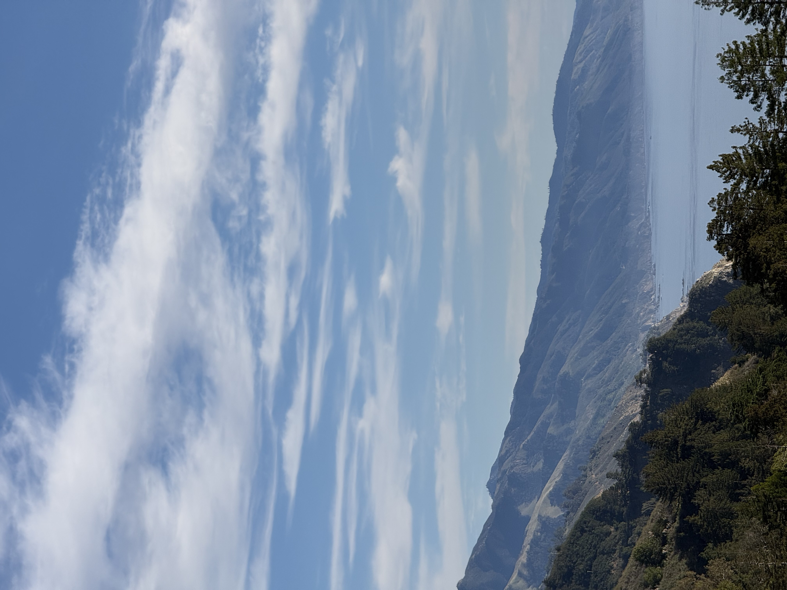
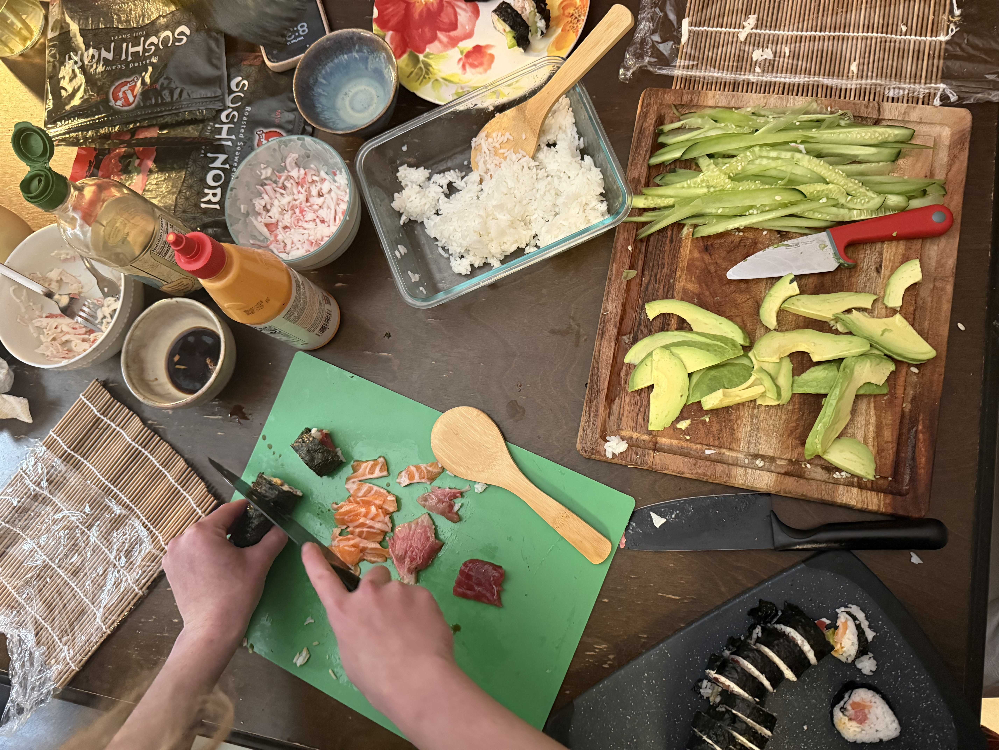
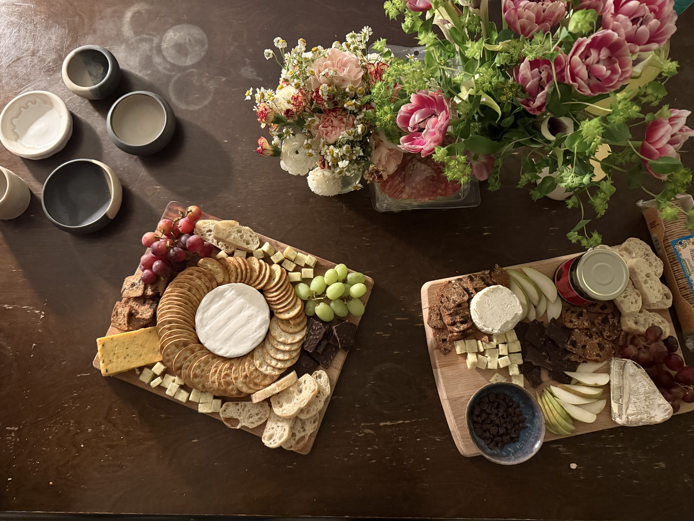
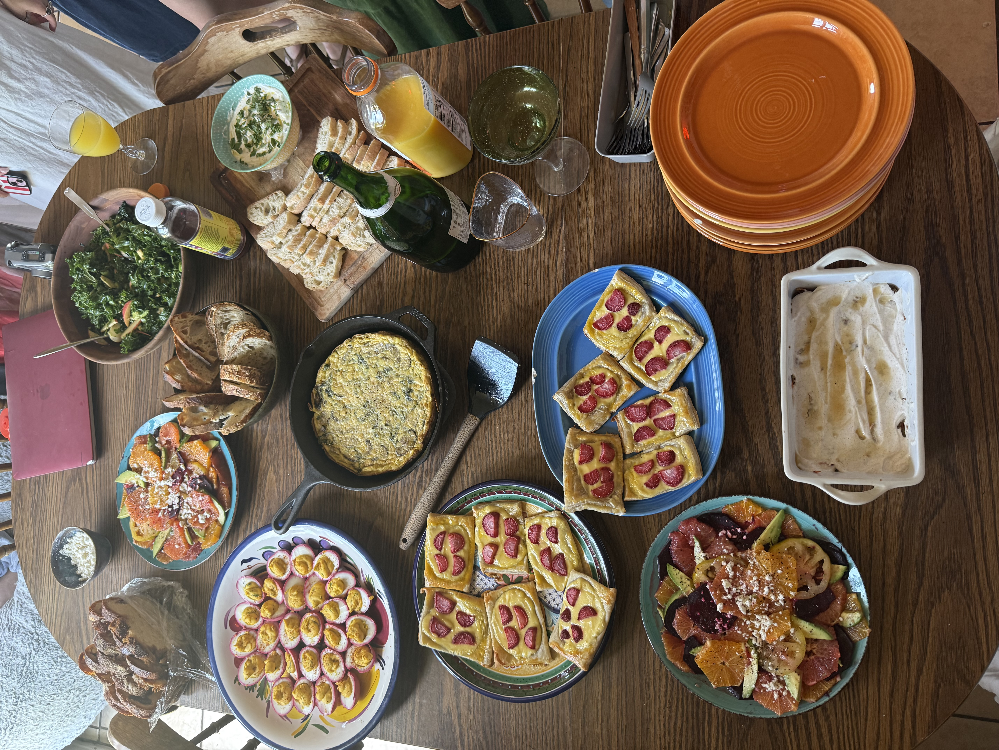

Hobbies
--
::: {.columns}

::: {.column width="60%"}
I love all things outdoors! Whether it is backpacking, camping, surfing, SCUBA Diving, or hiking, I enjoy it all and feel my happiest outdoors. One of my all-time favorite places to go is Big Sur! I also like to do yoga as well as bake dishes.

:::

::: {.column width="40%"}
{width=70%}

{width=70%}

:::

::::

Food
--

I love cooking and sharing food with my friends! It is, in my opinion, a universal love that everyone can enjoy. Whenever I can, I try to host a potluck. Here are some of the few I have done.

:::: {layout-ncol=3}
{width=80%}

{width=80%}

{width=80%}
::::

NOLS
--
:::: {.columns}

::: {.column width="60%"}
In high school, I completed a 30-day long backpacking course through the National Outdoor Leadership School (NOLS) in the North Cascades of Washington and Okenagon-Wenatchee National Forest. 

This  was the first time I ever went backpacking and where my love for camping and outdoors really flourished. I learned so many skills both about backpacking but also group dynamics that I still use today. 

:::

::: {.column width="40%"}
{width=100%}

{width=100%}

:::

::::

Future
--

I have had numerous experiences in undergrad that have taught me valuable skills and research. In the future, I hope to get the opportunity to continue to get research experience focused on fisheries management and ocean conservation. 

Outside of my career, I hope to be able to travel more and experience new cultures. I have my eyes on Central America!