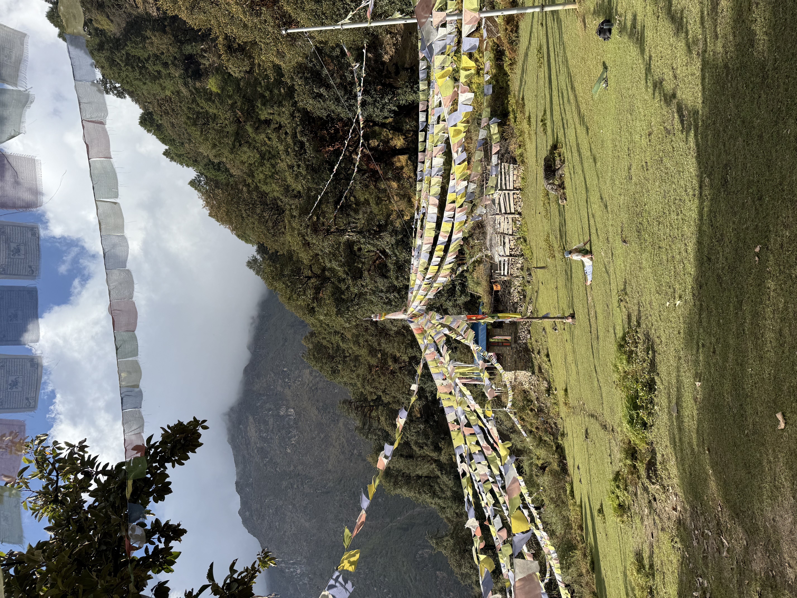
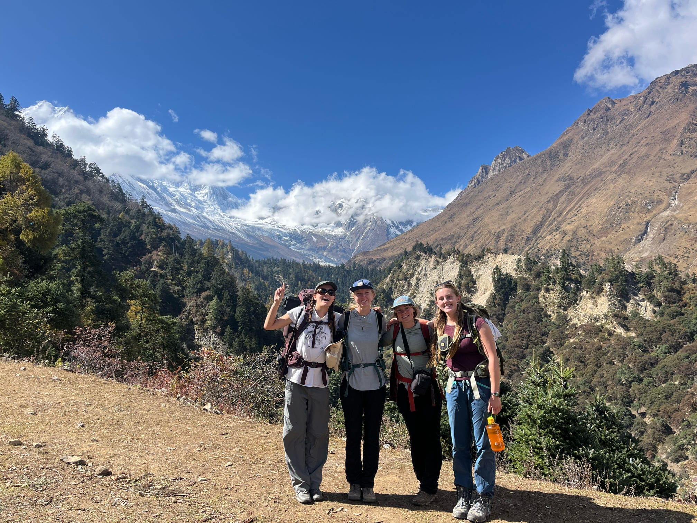
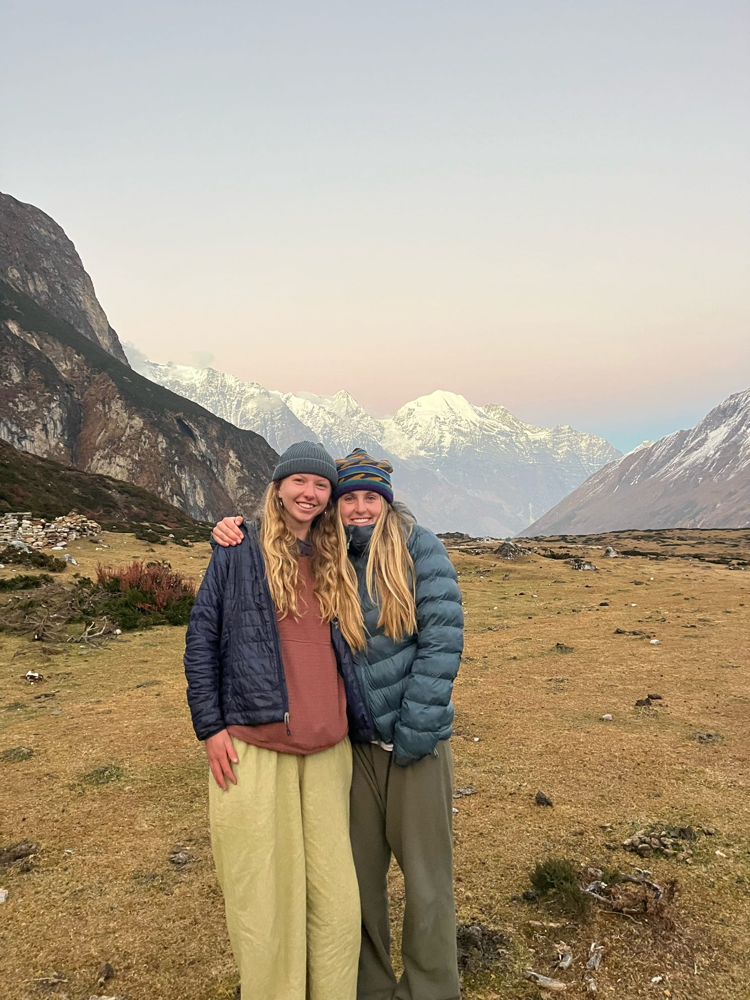
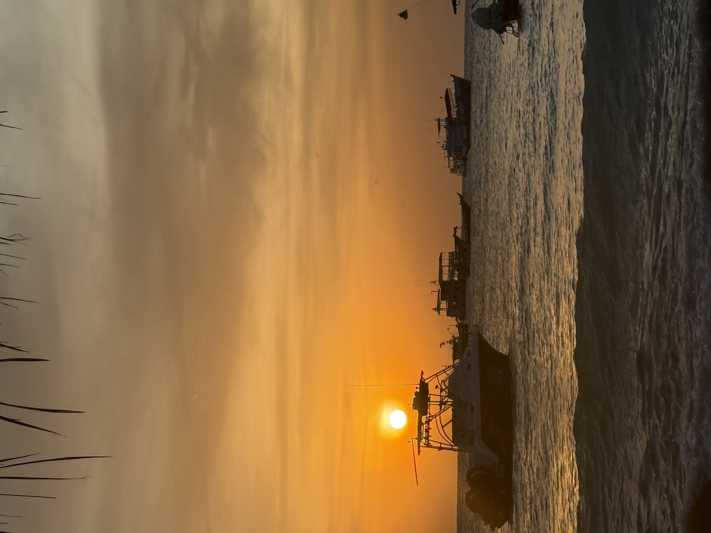
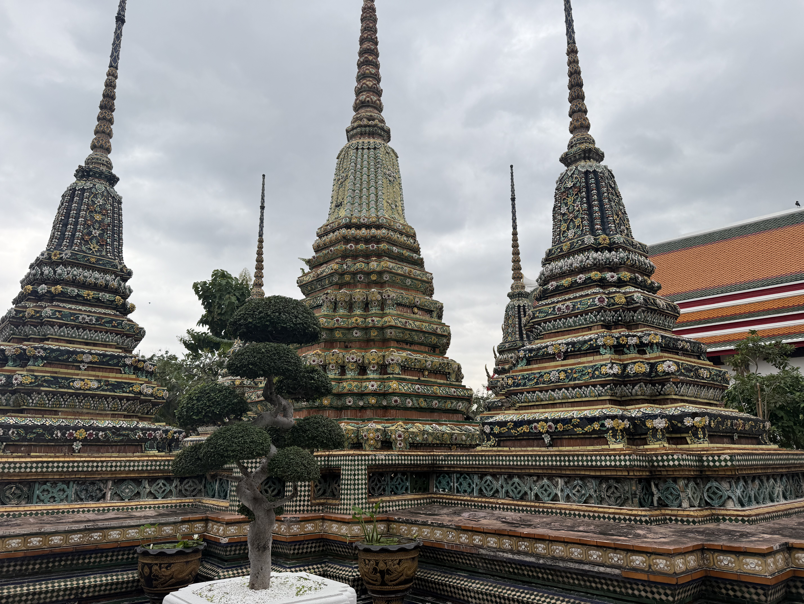
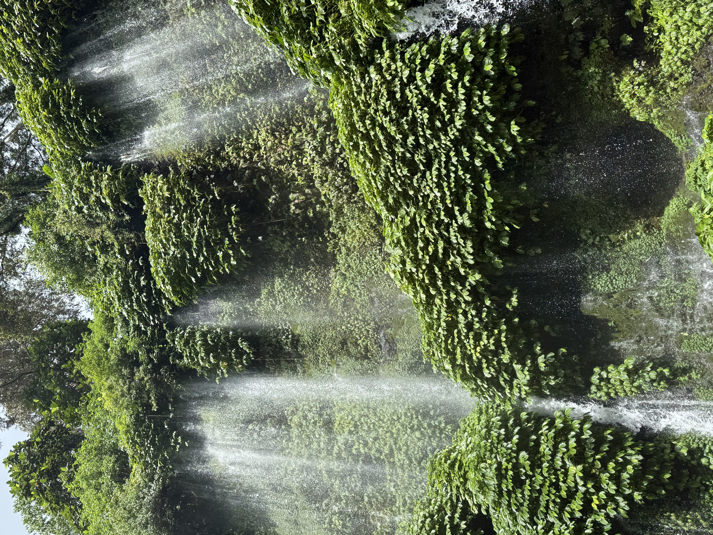
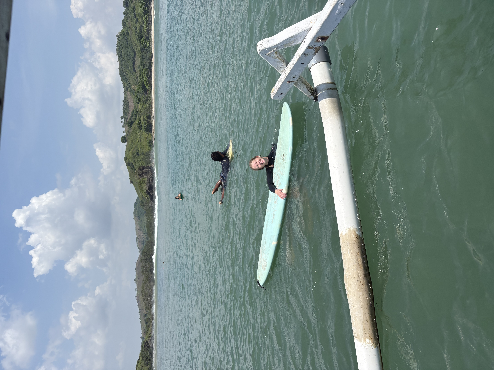

In Fall of 2025, I was very fortunate to travel around Asia and Southeast Asia for a little bit. It started in Nepal where I did a study-abroad program and then traveled to a couple places after. Below is a map of all the cities I traveled to from October-December!

```{r}
#| message: false
# load packages
library(leaflet)
library(tidyverse)
library(janitor)
library(leaflet.extras)
library(dplyr)
```

```{r}
#| message: false
# reading in data
travels <- read_csv("files/southeast-asia-travels_updated.csv")

# cleaning column names
travels_clean <- travels |> 
clean_names()

travel_icon <- makeIcon(
  iconUrl = ("location_pin.png"),
  iconWidth = 35,
  iconHeight = 35
)

# initialize map
site_map <- leaflet() |> 
  
  # addding base map tiles 
  addProviderTiles(providers$Esri.WorldImagery, group = "ESRI World Imagery") |> 
  addProviderTiles(providers$Esri.OceanBasemap, group = "ESRI Oceans") |>  
  
  # adding mini map
  addMiniMap(toggleDisplay = TRUE, minimized = TRUE) |>  
  
  # set view over Asia
  setView(lng = 105.99, lat = 15.87, zoom = 3) |>  
  
  # add country markers
  addMarkers(data = travels_clean, group = "Travel Sites",
             icon = travel_icon,
             lng = ~long, 
             lat = ~lat,
             popup = paste("Place:", travels_clean$city, ",", travels_clean$country, "<br>",
              "Coordinates (lat/long):", travels_clean$lat, ",", travels_clean$long)) |> 

  # add layers control (toggle base map tiles & markers based on group IDs)
  addLayersControl(
    baseGroups = c("ESRI World Imagery", "ESRI Oceans"),
    overlayGroups = c("Travel Sites")) |> 
  # add reset map button
  leaflet.extras::addResetMapButton()

# print map
site_map

```


Here is a compilation of photos from those travels and a little bit more about them.

Nepal
--

In Fall of 2025, I had the chance to a field study program in the Manaslu Region of Nepal. We studied climactic vulnerabilities and Himalayan habitats. This experience was truly life changing, having the opportunity to immersed in the culture and see the landscapes in Nepal is something I will always remember. 

:::: {layout-ncol=3}





::::

Thailand
--
After Nepal, I travelled to both Bangkok, Thailand and an island on the Southeast part of Thailand called Koh Tao where I spent two weeks and did some SCUBA diving. 

::: {layout-ncol=3}





:::

Indonesia
--
After I stayed in Thailand, I was fortunate to travel to Indonesia, where I spent most of my time enjoying the natural beauty and surfing.

:::: {layout-ncol=2}



