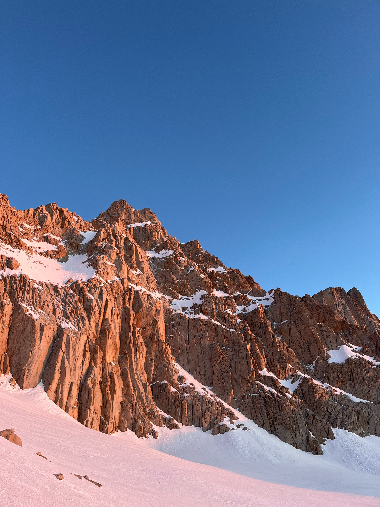

Nepal
--

In Fall of 2025, I had the chance to a field study program in the Manaslu Region of Nepal. We studied climactic vulnerabilities and Himalayan habitats. This experience was truly life changing, having the opportunity to immersed in the culture and see the landscapes in Nepal is something I will always remember. 

:::: {layout-ncol=3}

::::

Thailand
--
After Nepal, I travelled to both Bangkok, Thailand and an island on the Southeast part of Thailand called Koh Tao where I spent two weeks and did some SCUBA diving. 

::: {layout-ncol=3}

:::
Mt. Whitney
--

In the spring of my freshman year, I summited Mt. Whitney! This was my first real experience with mountaineering. It was difficult but very worth it!

::: {layout-ncol=2}

:::

Half Dome
--

Indonesia
--